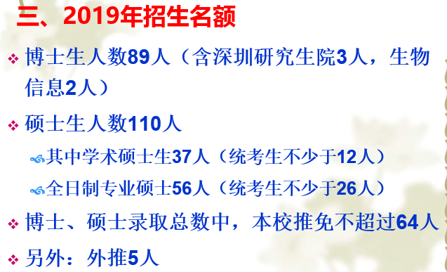

# 2020 统招信息（144+43）

## 912（81+6）

| 专业               | 复试                                                         | 人数 |
| ------------------ | ------------------------------------------------------------ | ---- |
| 计算机科学与技术   | **计算机系统结构**,编译原理；**编译原理**,**数据库原理**；**人工智能**,**多媒体技术** | 14   |
| 网络空间安全       | **计算机网络**                                               | 10   |
| 计算机技术         | 计算机系统结构、**软件工程**（二选一）                       | 37   |
| 大数据工程         | 数学（高数线代概率），专业知识（**模式识别**、人工智能导论、**机器学习**） | 20   |
| 数据科学和信息技术 | [全球创新学院](http://gix.tsinghua.ed u.cn/zs1/index.htm)【专门报名，需要TOELF】 | (6)  |
## 914（10）

| 专业           | 复试                 | 人数 |
| -------------- | -------------------- | ---- |
| 软件工程       | 编译原理、数据库原理 | 2    |
| 软件工程(工程) | 编译原理、数据库原理 | 8    |

## 827（53+15）

| 专业               | 复试                                                         | 人数 |
| ------------------ | ------------------------------------------------------------ | ---- |
| 人工智能           | 数学（高数线代概率），专业知识（模式识别、人工智能导论、机器学习、**电路原理**、**信号与系统**） | 53   |
| 大数据工程（贵州） | 控制理论（经典控制及现代控制）、电子技术（模拟电子技术及数字电子技术）、信号与系统、计算机软件技术基础（C 语言、数据结构），四科中选一门。 | (15) |

## 962（22-）

| 专业                       | 复试                                                         | 人数 |
| -------------------------- | ------------------------------------------------------------ | ---- |
| 数据科学交叉学科（伯克利） | **962**：数据科学等相关基础知识（运筹学、随机过程、数据结构？） 961：大学物理等相关基础知识（重点考察理科基础） | (22) |

---

2020，祝好！

-----

每年学硕面试线（非初试线）在**360**上下浮动。

> 基本分数在360~400。因此平均分数在**380**分（130+110+70+70）左右。

---

2019年招生名额如下：（**12**人）

2019年研究所状况如下：

各所教学所长联系电话：

